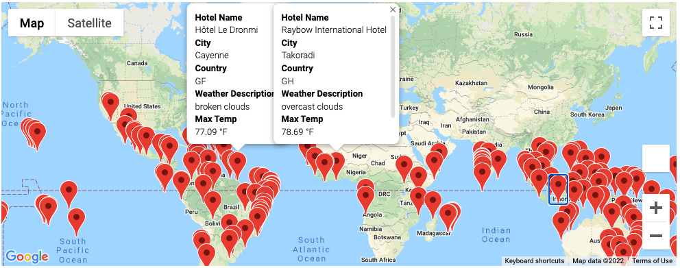
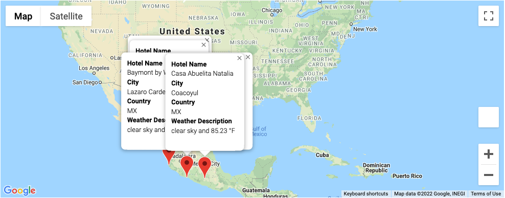

# World_Weather_Analysis

## Overview
In this challenge, I collected a list of cities from coordinates and used multiple API keys to extract information in order to create a vacation weather map and vacation itinerary. I pulled weather information so users can find their ideal travel destination based on their weather preference. 

I first created a DataFrame that contained the list of cities I wanted to collect weather information on. I then connected my OpenWeather API key and built a URL to extract weather data for every city in the list. 

I wrote a code that will prompt the user to enter a minimum and maximum temperature preference and a new DataFrame with the list of cities in that temperature range will appear, along with a map with markers through an API call to Google Maps API. 

I also created a vacation itinerary with Google Maps API, Google Places API and Google Directions API. 

## Results

I created a map with markers for all cities with available hotels and temperatures between 75°F and 95°F using Google Maps Javascript API near by search function. See below.

I also chose four cities in Mexico to create a vacation itinerary that fit all of the user's criteria for weather. I used the Google Directions API layer to create a driving map to each city location. See below. 

